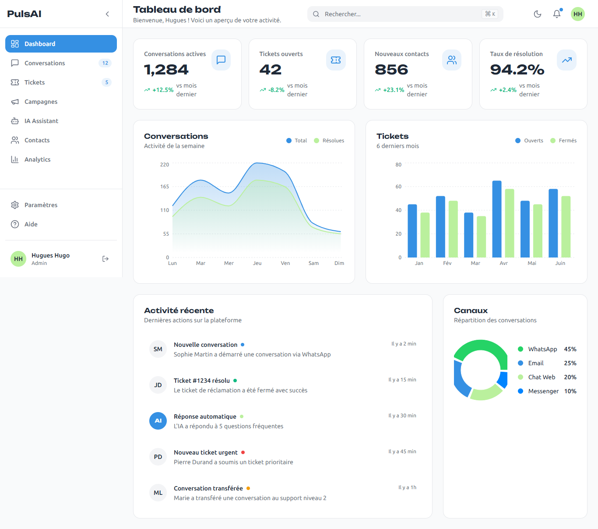
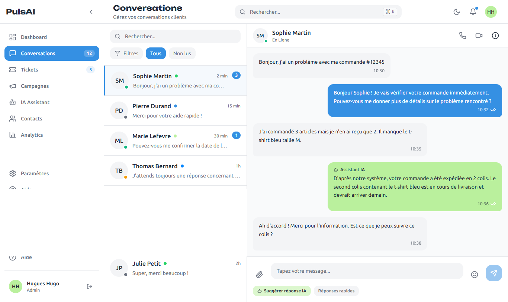
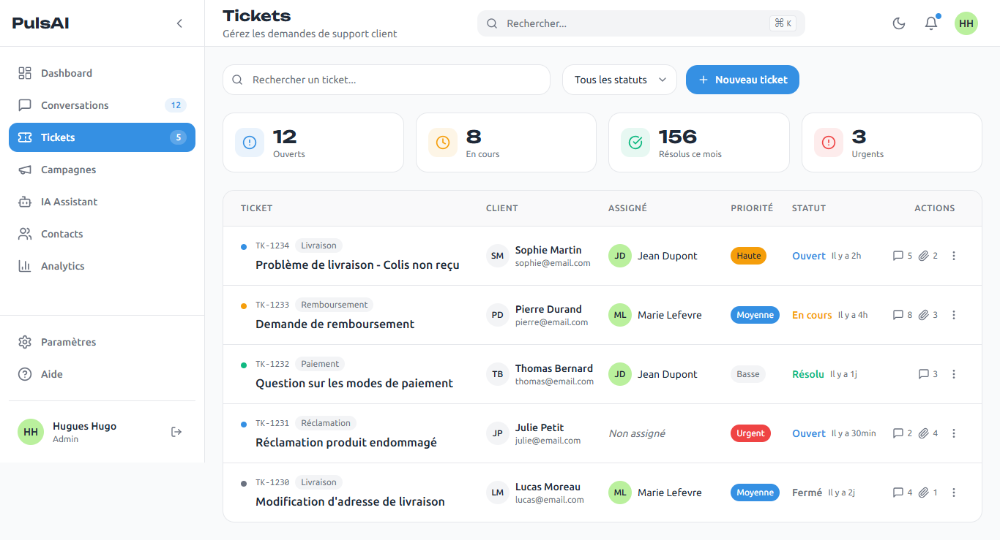
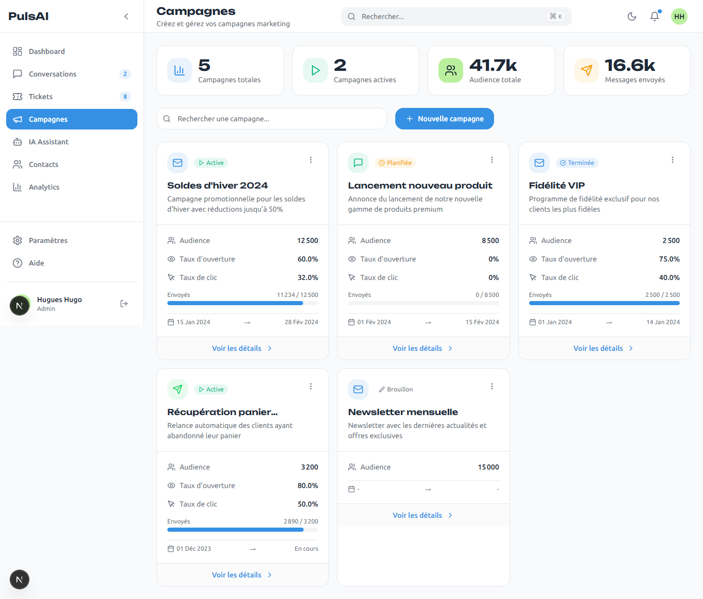
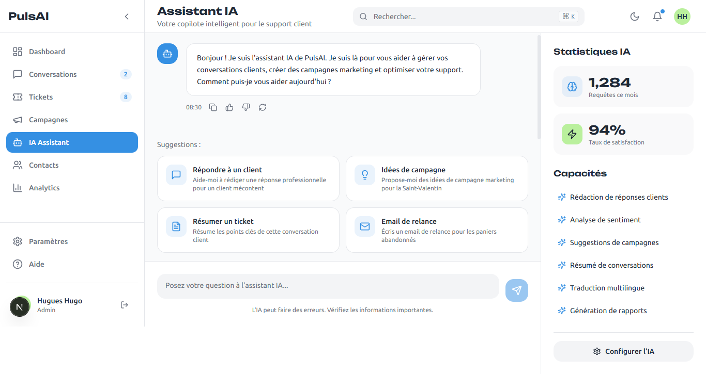
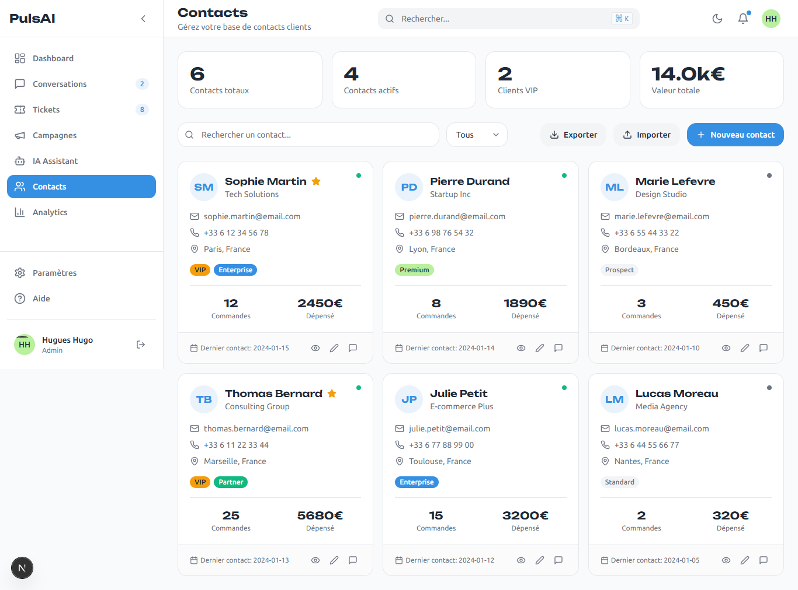
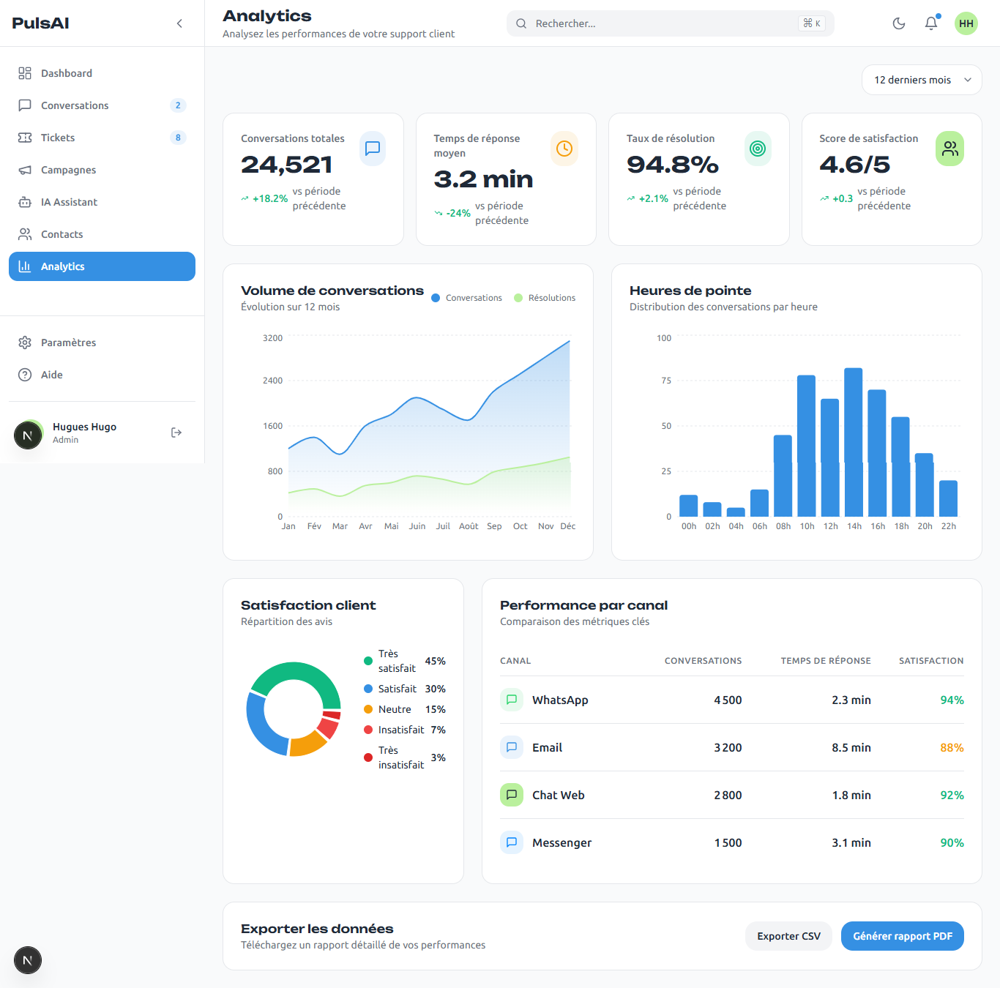
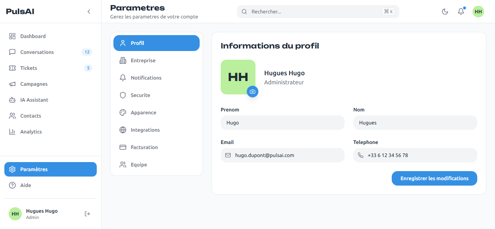
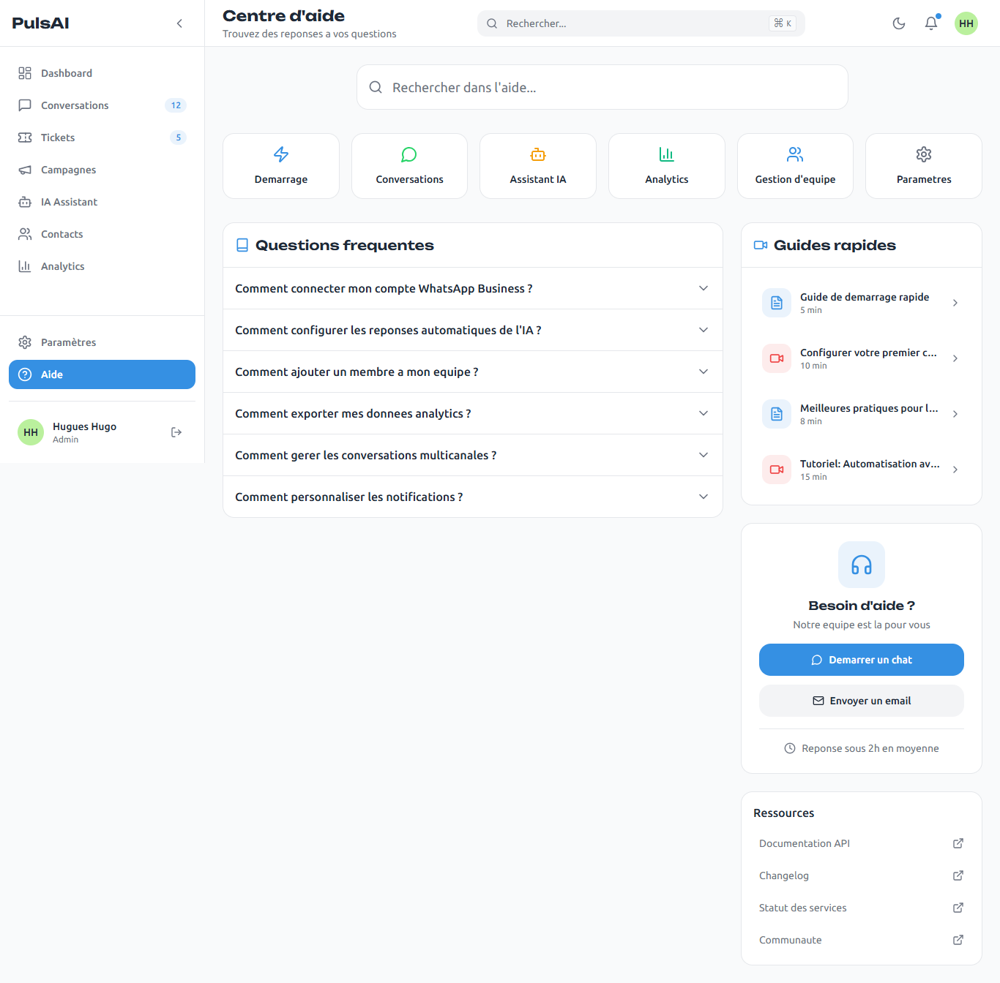

# PulsAI - CRM Intelligent


## Description du projet

PulsAI est une plateforme CRM (Customer Relationship Management) intelligente qui combine :

- IA Conversationnelle : Assistant IA integre pour automatiser les reponses et analyser les sentiments clients
- Gestion de Tickets : Systeme complet de support client avec priorites, assignations et suivi
- Automatisation Marketing : Creation et gestion de campagnes email, SMS et WhatsApp
- Communication Omnicanale : Centralisation des conversations WhatsApp, Email, Chat et Messenger
- Analytics Avances : Tableaux de bord et rapports detailles sur les performances

Cette application est concue pour les entreprises souhaitant optimiser leur relation client grace a l'intelligence artificielle.

---

## Stack Technique

| Technologie | Version | Description |
|-------------|---------|-------------|
| **Next.js** | 16 | Framework React avec App Router |
| **React** | 19 | Bibliotheque UI |
| **TypeScript/JavaScript** | ES2024 | Langage de programmation |
| **Tailwind CSS** | 4.0 | Framework CSS utilitaire |
| **Framer Motion** | 11.15 | Animations fluides |
| **Recharts** | 2.x | Graphiques et visualisations |
| **Lucide React** | 0.454 | Icones |

### Architecture

```
/app
  /dashboard
    /page.jsx           # Dashboard principal
    /conversations      # Gestion des conversations
    /tickets            # Systeme de tickets
    /campaigns          # Campagnes marketing
    /ai-assistant       # Assistant IA
    /contacts           # Gestion des contacts
    /analytics          # Statistiques et rapports
    /settings           # Parametres utilisateur
    /help               # Centre d'aide
/components
  /dashboard
    /sidebar.jsx        # Navigation laterale
    /mobile-sidebar.jsx # Navigation mobile responsive
    /header.jsx         # En-tete avec notifications
    /stats-card.jsx     # Cartes de statistiques
    /charts.jsx         # Composants graphiques
    /recent-activity.jsx# Activite recente
/utils
  /data.js  # Données statiques
/lib
  /utils.ts  # Fonction utilitaire pour l'utilisation de cn qui permet la fusion de css dynamique et chaine de caractère 

   
```

---

## Instructions d'installation

### Prerequis

- Node.js 18.x ou superieur
- npm 9.x ou yarn 1.22.x

### Installation

1. **Cloner le repository**
```bash
git clone https://github.com/HugoCoder1/PulsAI_frontend.git
cd pulsai-frontend
```

2. **Installer les dependances**
```bash
npm install
```

3. **Lancer le serveur de developpement**
```bash
npm run dev
```

4. **Ouvrir dans le navigateur**
```
http://localhost:3000/dashboard
```

### Build de production

```bash
npm run build
npm start
```

---

## Captures d'ecran des principales pages

### 1. Dashboard Principal


Vue d'ensemble avec KPIs, graphiques de performance et activite recente.

**Fonctionnalites :**
- 4 cartes de statistiques animees (Conversations, Tickets, Taux resolution, Temps moyen)
- Graphique des conversations sur 7 jours
- Graphique circulaire des canaux de communication
- Liste des activites recentes avec timeline

### 2. Conversations


Interface de messagerie omnicanale style chat moderne.

**Fonctionnalites :**
- Liste des conversations avec filtres (Tous, Non lus, par canal)
- Recherche en temps reel
- Vue de conversation complete avec historique
- Indicateurs de canal (WhatsApp, Email, Chat, Messenger)
- Panneau d'informations client coulissant

### 3. Tickets


Systeme de gestion de tickets complet.

**Fonctionnalites :**
- Tableau des tickets avec tri et filtres par statut
- Modal de creation de nouveau ticket avec pieces jointes
- Vue detaillee du ticket avec timeline
- Tags de priorite et statut colores
- Assignation d'agents

### 4. Campagnes Marketing


Gestion des campagnes email, SMS et WhatsApp.

**Fonctionnalites :**
- Liste des campagnes avec statistiques (envois, ouvertures, clics)
- Creation de nouvelle campagne avec selection de type
- Planification et ciblage d'audience
- Indicateurs de performance en temps reel

### 5. Assistant IA


Interface de chat avec l'IA integree.

**Fonctionnalites :**
- Conversations avec l'assistant IA
- Suggestions de reponses automatiques
- Analyse de sentiments
- Historique des interactions

### 6. Contacts


Gestion complete des contacts clients.

**Fonctionnalites :**
- Liste des contacts avec recherche et filtres
- Fiches contacts detaillees
- Tags et segmentation
- Import/Export de contacts

### 7. Analytics

Tableaux de bord analytiques avances.

**Fonctionnalites :**
- Graphiques de performance temporels
- Repartition par canal
- Metriques de satisfaction client
- Rapports exportables

### 8. Parametres


Configuration complete de l'application.

**Fonctionnalites :**
- Profil utilisateur
- Parametres entreprise
- Notifications (email, push, SMS)
- Securite (2FA, sessions)
- Theme clair/sombre
- Integrations tierces
- Gestion de l'equipe

### 9. Centre d'Aide


Documentation et support.

**Fonctionnalites :**
- FAQ interactive avec accordeons
- Guides de demarrage rapide
- Recherche dans la documentation
- Contact support

---

## Liste des pages implementees

| Page | Route | Status |
|------|-------|--------|
| Dashboard | `/dashboard` | Complet |
| Conversations | `/dashboard/conversations` | Complet |
| Tickets | `/dashboard/tickets` | Complet |
| Campagnes | `/dashboard/campaigns` | Complet |
| Assistant IA | `/dashboard/ai-assistant` | Complet |
| Contacts | `/dashboard/contacts` | Complet |
| Analytics | `/dashboard/analytics` | Complet |
| Parametres | `/dashboard/settings` | Complet |
| Aide | `/dashboard/help` | Complet |

---

## Fonctionnalites Responsive

L'application est entierement responsive avec :

- **Desktop (1024px+)** : Sidebar fixe a gauche, contenu principal a droite
- **Tablet (768px-1023px)** : Layout adaptatif
- **Mobile (-767px)** : Header fixe avec menu hamburger, navigation coulissante

---

## Theme et Design

### Palette de couleurs

| Couleur | Code | Utilisation |
|---------|------|-------------|
| Bleu Principal | `#3590E3` | Actions principales, liens, accents |
| Vert Secondaire | `#BAF09D` | Succes, validations, badges |
| Gris Clair | `#F9FAFB` | Fond principal |
| Gris Fonce | `#1F2937` | Textes, titres |

### Typographies

- **Titres** : Unbounded (font-heading)
- **Corps** : Ubuntu (font-sans)

---

## Deploiement

### Vercel : https://puls-ai-frontend.vercel.app


## Contact

Pour toute question ou suggestion, contactez-nous a hugueshugues2002@gmail.com
